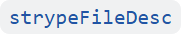
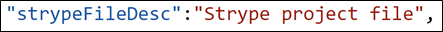
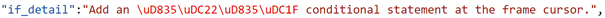
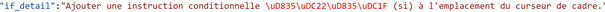
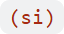
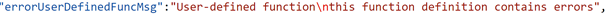
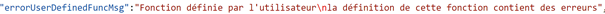
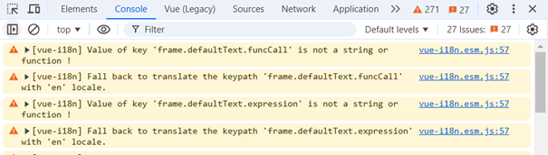

# Guidelines to translations in Strype

The process for translating Strype is simple. It relies on text files, and the reference for all translations is the English version.

This guide explains:

-   [How to retrieve or create the translation files](#how-to-retrieve-or-create-the-translation-filess)
-   [How to understand the translations files](#how-to-understand-the-translations-files)
-   [How to do the translations.](#how-to-do-the-translations)
-   [How to visualise the translations on a test project.](#how-to-visualise-the-translations-on-a-test-project)
-   [How to submit the translations.](#how-to-submit-the-translations)

This guide focuses on translations *directly* handled by the Strype website. Translators may otherwise contribute to the localisation of <a href="https://github.com/Tobias-Kohn/TigerPython-Parser" target="_blank">TigerPython</a>, which is used by Strype to display Python parsing error messages.

>[!NOTE]
>Currently, all translations are taking effect in Strype when a new version of the application is released by the Strype team. So even if a translation has been received by the Strype team and included into the source code repository, it will be visible in the online tool only when the Strype team releases a new version.

## How to retrieve or create the translation files

>[!IMPORTANT]
>A [localisation tool](https://strype.org/localisation-tool/) is available for easing the translation work. \
>Nevertheless, we strongly recommend translators to read the following documentation to understand how Strype handles localisation.

To retrieve the translation files, you will need to locate them inside the Strype source code repository hosted in GitHub (<a href="https://github.com/k-pet-group/Strype" target="_blank">https://github.com/k-pet-group/Strype</a>).

The translation files for all supported locales are inside the `/src/localisation/` folder, which contains **one subfolder per locale (as a <a href="https://en.wikipedia.org/wiki/List_of_ISO_639_language_codes" target="_blank">2-letter code</a>)**. For example, the translations for English are in <code>/src/localisation/**en**/</code>, those of Spanish are in <code>/src/localisation/**es**/</code> and so on.

A locale subfolder contains several translation JSON files, their names start with the 2-letter code of the locale (for example, `en_main.json`). We split the translations in several files to ease the translation task and gather some specific translations separately (for example for Strype micro:bit).

You can either download a raw file from GitHub (by clicking on the desired file and clicking on the “download” button) OR you can use a web development IDE to work on the whole Strype project directly (cloning the project from GitHub with GIT). This option requires more preparation work (see the project’s <a href="../../README.md" target="_blank">README</a> for more details) **but will allow you to test your translation locally**.

If the locale you wish to provide translation for does *not* exist, you will need to create a new subfolder (named after the 2-letter code of the locale) and add your translation files following the same naming logic as mentioned above. The easiest way is to copy one of the `en_*.json`, rename it with the right locale code, and edit it with your translations.

>[!NOTE]
>It is advised, if you want to retrieve a copy of the Strype source code, to first create a fork of the project into your own GitHub account, and use your forked project as a remote GIT repository.

## How to understand the translations files

The translation files are <a href="https://en.wikipedia.org/wiki/JSON" target="_blank">JSON</a> files: formatted text files that define **_key_:_value_ pairs**. There are several files per language, identified by the corresponding locale and gathered inside one subfolder for that locale (see section [1](#how-to-retrieve-or-create-the-translation-files) for more details).

The *key* is used by Strype as *a reference* to a localisable text, independent of the locale.  
The corresponding *value* is the localised text *that will be displayed* in Strype, in a given locale.  
The *key* and its corresponding *value* are separated by a colon `:`.

Here is an example of a *key:value* pair for English, where the *key* (i.e.reference) used by Strype is  and the *value* displayed in Strype is .

>[!CAUTION]
>Only the **value** text need to be translated.

## How to do the translations

>[!IMPORTANT]
>A [localisation tool](https://strype.org/localisation-tool/) is available for translators to easily generate the translations files. \
Nevertheless, we strongly recommend a thorough reading of the following section before starting using the tool: it contains **important rules to follow regarding the translations**.

The language reference for all translations is the English locale. Therefore, the reference files are the files located in the `/en/` subfolder (see sections [1](#how-to-retrieve-or-create-the-translation-files) and [2](#how-to-understand-the-translations-files) for details about finding the files and understanding their formats).

**Each** *key:value* pair of a translation locale file **need to match those of the equivalent English locale file**, and as explained above, **only** the *value* texts need to be translated.

The expected file encoding is **UTF-8** (which would be default encoding in most modern text editors).

Here are a few rules to follow when doing the translations of the text *values*.

- Leading and trailing spaces showing in the English *value* texts **should be maintained** in the translated locale.
- Some *value* texts contain Unicode characters starting with `\u`, followed by 4 characters. The *key* for these pairs is in this format: `<Python keyword>_detail`. The Unicode characters represent a Python keyword.
  - The Unicode characters **should not be altered** in the translation.
  - A translation of the Python keyword can be added into brackets for the given locale. For example, the English reference contains this *key:value* pair:  which can be translated in another locale as such:  The Unicode characters stay the same in both locales, and  has been added in the translation to provide the literal translation of the Python keyword too.
- Some *value* texts contain HTML tags or codes (such as `<b>` or `&larr;`). They are interpreted as such by Strype to style the text in the browser, and therefore **should stay in the translation**. However the text content between the opening and closing tags can be translated if that makes sense.
- Some *value* texts contain curly brackets surrounding a word. These are used by Strype as placeholders to dynamically add pieces of text within the translation, and therefore the content between the curly brackets **should not be changed**.
- Some *value* texts contain an escaped character starting with `\` which **should stay in the translation**. 
For example, the English reference contains this *key:value* pair:  That can be translated in another locale as such:  The escape character `\n` is left in the translation.
- For the micro:bit documentation translation, the English reference is based on <a href="https://microbit-micropython.readthedocs.io" target="_blank">the micro:bit documentation</a> which may be available in other languages.

>[!IMPORTANT]
>In case of doubts, please contact us ([team@strype.org](mailto:team@strype.org)) for explanations.

## How to visualise the translations on a test project

The only way to see how your translations are rendered in Strype is to download the project source code and run it. See section [1](#how-to-retrieve-or-create-the-translation-files) for details on where to retrieve the Strype source code.   
  
If you have edited your translations *outside* the code source (for example if started working on a translation before downloading and installing the Strype project), you need to make sure that your changes are applied into your local copy of Strype before running the project (check the project’s <a href="../../README.md" target="_target">README</a> for the procedure).

>[!TIP]
>When you want to check which translations are missing from Strype, run the project as explained above, and once your local version of the Strype application is opened with your Internet browser, open the development tool (<a href="https://jeffrey1183.gitbooks.io/intro-to-programming/content/front-end-development/what-is-javascript/4developer-tools-on-different-browsers.html" target="_blank">how?</a>).

You will see each JSON keys that are missing a value.

Example:

## How to submit the translations

There are 2 ways you can submit your translations: either sending the locale file(s) to us directly ([team@strype.org](mailto:team@strype.org)) or, if you have downloaded and installed a local copy of the Strype source code (see section [1](#how-to-retrieve-or-create-the-translation-files), you can commit your changes (with GIT), push your changes to the remote GIT repository and create a Pull Request on GitHub for us to review your changes.

>[!NOTE]
>Since English is the reference language used by Strype, *any missing translations in a locale will be rendered in Strype in English*. This means that if you prefer sending us your translations in several steps (for example, a file at a time), Strype will still be able to run with some missing translations.
